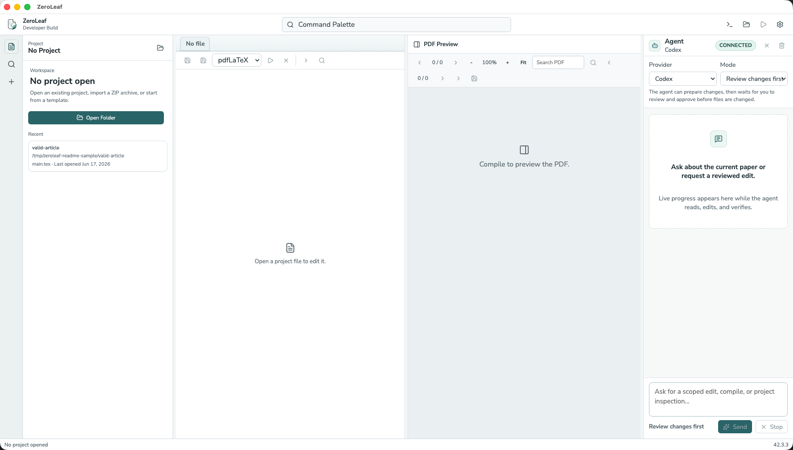
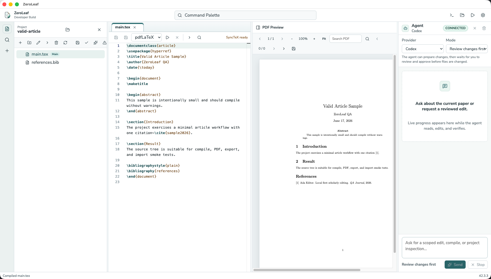

# Zeroleaf

Local-first desktop LaTeX editing with a patch-first AI agent.

Zeroleaf is an alpha Electron app for researchers, students, and technical
writers who want an Overleaf-style writing environment that stays on their
computer. It opens local LaTeX projects, edits source files, compiles with
`latexmk`, previews the resulting PDF, surfaces diagnostics, and can hand scoped
project tasks to local CLI agents such as Codex CLI or Claude Code.

The product direction is intentionally local-first and light-only: a scholarly
IDE for writing, compiling, reviewing, and safely applying agent-proposed
changes without moving the project into a cloud editor.





## Features

- Open local LaTeX projects and recent project folders.
- Browse, create, rename, move, delete, and refresh files from the project tree.
- Edit `.tex` and `.bib` files in a Monaco-based source editor with tabs.
- Set a main `.tex` file and compile through `latexmk` with pdfLaTeX, XeLaTeX,
  or LuaLaTeX.
- Preview the compiled PDF next to the editor with search, zoom, page controls,
  and SyncTeX hooks.
- Inspect build problems, raw logs, output, outline, search results, references,
  and history from the bottom workbench panel.
- Analyze bibliography files, search citations, insert citations, and detect
  missing or unused references.
- Create projects from built-in templates, import source ZIPs, export source
  ZIPs, save PDFs, and run submission-bundle checks.
- Keep local snapshots and changesets so agent edits can be reviewed, applied,
  rejected, or rolled back.
- Connect to Codex CLI or Claude Code through the provider-neutral agent
  interface. Zeroleaf uses the CLI login already configured on your computer; it
  does not ask for provider API keys inside the app.

## Status

Current version: `0.0.0-alpha.2`

This is a private alpha. macOS packaging is available, while Windows/Linux
packaging, cloud sync, collaboration, dark mode, visual editing, unrestricted
shell agents, and autonomous network-enabled agents are intentionally out of
scope for now.

## Requirements

- macOS for the current packaged alpha.
- A TeX distribution with `latexmk` and `pdflatex` available on `PATH`.
- Optional: Codex CLI and/or Claude Code installed and logged in for real agent
  workflows.

Check the LaTeX toolchain:

```bash
latexmk -version
pdflatex --version
```

## Install

Download the latest packaged macOS alpha from GitHub Releases:

- [ZeroLeaf-0.0.0-alpha.2-mac.zip](https://github.com/Amirmoradi94/zeroleaf/releases/download/v0.0.0-alpha.2/ZeroLeaf-0.0.0-alpha.2-mac.zip)
- [All releases](https://github.com/Amirmoradi94/zeroleaf/releases)

Then:

1. Unzip `ZeroLeaf-0.0.0-alpha.2-mac.zip`.
2. Move `ZeroLeaf.app` to `Applications` or another local folder.
3. Right-click `ZeroLeaf.app` and choose `Open`.
4. Confirm the macOS security prompt.

This alpha build is unsigned and not notarized. If macOS blocks it, open
`System Settings > Privacy & Security` and allow the app from there.

## Build From Source

Source builds are for contributors and local development. You need Node.js
`20.19` or newer and npm `10` or newer.

Clone the repository, install dependencies, build the app, then launch Electron:

```bash
git clone <repo-url>
cd overleaf-clone
npm install
npm run build
npm run dev
```

During development, `npm run dev` starts the Vite renderer server and launches
Electron.

To package a macOS ZIP locally:

```bash
npm run package:mac:zip
```

The release ZIP is written under `release/mac/`.

## Codex Setup

Zeroleaf talks to Codex through the local `codex` executable. Install and sign
in once from your terminal, then select Codex in the app's Agent panel.

On macOS or Linux, the official standalone installer is:

```bash
curl -fsSL https://chatgpt.com/codex/install.sh | sh
```

You can also install with npm or Homebrew:

```bash
npm install -g @openai/codex
brew install --cask codex
```

Start Codex and complete the login flow:

```bash
codex
```

Codex supports ChatGPT sign-in for subscription access and API-key sign-in for
usage-based access. Zeroleaf uses whichever authenticated local Codex session
the CLI provides.

Verify the CLI is visible to Zeroleaf:

```bash
which codex
codex --version
```

Official reference: [Codex quickstart](https://developers.openai.com/codex/quickstart).

## Claude Code Setup

Zeroleaf talks to Claude through the local `claude` executable. Install and sign
in once from your terminal, then select Claude in the app's Agent panel.

The recommended native installer for macOS, Linux, or WSL is:

```bash
curl -fsSL https://claude.ai/install.sh | bash
```

Homebrew and npm are also supported:

```bash
brew install --cask claude-code
npm install -g @anthropic-ai/claude-code
```

Start Claude Code and follow the browser login prompts:

```bash
claude
```

Claude Code requires a Pro, Max, Team, Enterprise, or Console account. The free
Claude.ai plan does not include Claude Code access.

Verify the CLI is visible to Zeroleaf:

```bash
which claude
claude --version
claude doctor
```

Official reference: [Claude Code setup](https://code.claude.com/docs/en/setup).

## Using The App

1. Open a local LaTeX project folder.
2. Select or set the main `.tex` file.
3. Edit source in the center editor.
4. Click Compile Project to run `latexmk`.
5. Review the PDF preview, diagnostics, references, logs, and history.
6. Choose a provider in the Agent panel.
7. Ask for a scoped edit, compile repair, reference cleanup, or project
   inspection.
8. Review the proposed diff before applying changes.
9. Recompile and verify the PDF.

Agent edits are designed to be patch-first, reviewable, snapshot-backed, and
reversible. Network access, shell escape, outside-root writes, and destructive
operations are blocked or require explicit approval by design.

## Development Commands

```bash
npm run format:check
npm run lint
npm run typecheck
npm run test
npm run build
```

Private-alpha checks:

```bash
npm run alpha:readiness
npm run alpha:pilot
```

## Repository Layout

- `apps/desktop` - Electron main process, preload, renderer shell, and desktop
  UI.
- `packages/ipc-contracts` - typed IPC channel and payload contracts.
- `packages/project-service` - project roots, file trees, and safe local
  reads/writes.
- `packages/latex-service` - `latexmk` builds, diagnostics, logs, and SyncTeX.
- `packages/pdf-service` - PDF artifact reads and PDF preview contracts.
- `packages/reference-service` - `.bib`, citation, and reference workflows.
- `packages/history-service` - snapshots, patches, changesets, and rollback.
- `packages/agent-host` - agent process protocol and tool broker.
- `packages/provider-openai-codex` - Codex adapter.
- `packages/provider-anthropic-claude` - Claude adapter.
- `packages/security` - permission, path, risk, and approval helpers.
- `packages/ui` - shared light-only UI tokens and reusable UI pieces.

The renderer stays UI-only. Filesystem, shell, provider credentials, and OS
operations go through typed IPC and service packages rather than direct React
access.

## Documentation

- [Alpha user guide](docs/alpha-user-guide.md)
- [System architecture](docs/architecture/system-architecture.md)
- [Development plan](docs/development/trackable-development-plan.md)
- [Private alpha release notes](docs/release/private-alpha-release-notes.md)
- [Security review](docs/security/mvp-security-review.md)
