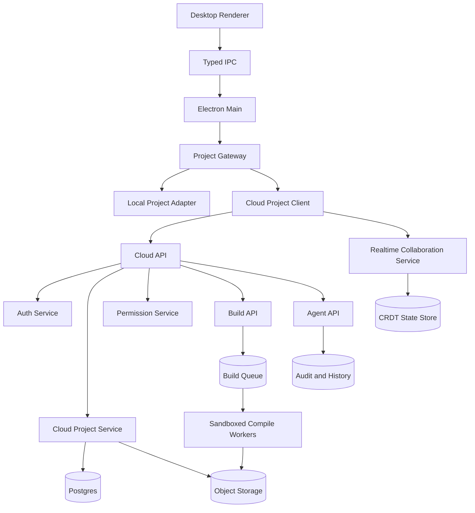

# Cloud Project Sharing Design

Date: 2026-06-15

## Purpose

Add Overleaf-style cloud project sharing to ZeroLeaf while preserving the current local-first desktop workflow as a separate mode. Cloud sharing is a roadmap expansion: shared projects need server-side identity, permissions, storage, realtime editing, build execution, and audit history. This document defines the target design and phased implementation path.

## Product Goals

- Users can create cloud-backed LaTeX projects from the desktop app.
- Project owners can invite other users by email and assign access roles.
- Collaborators can open the same project from their own local desktop app.
- Multiple users can edit project files concurrently with low-latency updates.
- Cloud projects can compile consistently even when a collaborator has no local TeX toolchain.
- Agent actions remain scoped, attributable, reviewable, and reversible in shared projects.
- Local projects continue to work without an account, network connection, or cloud dependency.

## Non-Goals

- Do not convert all local projects into cloud projects automatically.
- Do not sync arbitrary user folders.
- Do not allow the agent to write directly to a shared local filesystem folder as the sharing mechanism.
- Do not rely on each collaborator's local TeX installation for shared-project correctness.
- Do not implement unrestricted shell execution in cloud compile workers.
- Do not support anonymous public editing in the first version.

## Project Types

ZeroLeaf should support two first-class project types:

| Type          | Source of truth              | Collaboration                  | Compile path                                           | Offline behavior                                    |
| ------------- | ---------------------------- | ------------------------------ | ------------------------------------------------------ | --------------------------------------------------- |
| Local Project | User-selected folder on disk | None, except manual export/Git | Local `latexmk`                                        | Fully usable                                        |
| Cloud Project | Cloud project service        | Invite-based realtime sharing  | Cloud compile by default, optional local compile later | Read/edit cache only after explicit offline support |

This separation keeps the existing local security model intact. Cloud projects should not be represented internally as ordinary writable folders that happen to sync in the background. They need an explicit cloud project adapter behind the same renderer-facing project UI.

## User Experience

### Create Cloud Project

1. User signs in.
2. User selects `New Cloud Project`.
3. User chooses a template or imports a source zip.
4. App creates the project in the cloud service.
5. The project opens in the normal editor shell with a cloud status indicator.

### Share Project

1. Owner opens project sharing settings.
2. Owner enters collaborator email addresses.
3. Owner selects role: Owner, Editor, Viewer.
4. Service sends invitations.
5. Collaborators accept and the project appears in their cloud project list.

### Collaborative Editing

1. User opens a cloud project.
2. App connects to the realtime collaboration service.
3. File tree, active document state, and user presence load.
4. Text edits are sent as collaboration operations.
5. Remote edits appear in the editor without manual refresh.
6. Save status reflects server acknowledgement rather than local disk writes.

### Compile

1. User clicks `Compile`.
2. App requests a cloud build for the current project revision.
3. Compile worker checks out an isolated snapshot.
4. Worker runs the configured TeX build in a sandbox.
5. App streams build status, logs, diagnostics, and final PDF artifact.

### Agent Use

1. User asks the agent to inspect or edit a cloud project.
2. Agent tools operate through cloud project APIs, not local filesystem paths.
3. Proposed edits are represented as changesets.
4. Edits are attributed to the requesting user and agent provider.
5. Accepted edits enter the realtime document stream or are applied as a server-side patch.
6. Agent-triggered compiles run through the cloud build path unless the user explicitly selects local compile.

## Roles and Permissions

| Role   | Capabilities                                                                                                                                |
| ------ | ------------------------------------------------------------------------------------------------------------------------------------------- |
| Owner  | Manage project, billing/workspace membership later, collaborators, roles, deletion, transfer ownership, edit, compile, run agent if enabled |
| Editor | Edit files, upload assets, compile, comment later, run permitted agent actions                                                              |
| Viewer | Read source, view PDF, download allowed artifacts, no edits                                                                                 |

Future roles can include Commenter and Reviewer, but the first implementation should keep permissions small and enforceable.

Permission checks must happen server-side for every project operation. Renderer-side permission gating is only a usability layer.

## High-Level Architecture



## Desktop App Changes

### Project Gateway

Introduce a project gateway abstraction used by the main process and agent tool broker:

- `LocalProjectAdapter`: wraps existing filesystem-backed project service.
- `CloudProjectAdapter`: wraps authenticated cloud APIs and realtime sessions.

The renderer should keep using typed IPC contracts. It should not receive cloud tokens beyond short-lived session state needed for the preload-safe bridge, and it should never call arbitrary cloud endpoints directly.

Suggested interface shape:

```ts
type ProjectBackendKind = "local" | "cloud";

type ProjectHandle = {
  readonly id: string;
  readonly backend: ProjectBackendKind;
  readonly displayName: string;
  readonly rootPath?: string;
  readonly cloudProjectId?: string;
};

type ProjectGateway = {
  listRecentProjects(): Promise<readonly ProjectHandle[]>;
  openProject(handle: ProjectHandle): Promise<ProjectSession>;
  readFile(sessionId: string, path: string): Promise<ProjectFileSnapshot>;
  writeFile(
    sessionId: string,
    path: string,
    contents: string
  ): Promise<ProjectWriteResult>;
  listFiles(sessionId: string): Promise<ProjectTree>;
  createEntry(sessionId: string, request: CreateEntryRequest): Promise<ProjectTree>;
  deleteEntry(sessionId: string, request: DeleteEntryRequest): Promise<ProjectTree>;
  runBuild(sessionId: string, request: BuildRequest): Promise<BuildResult>;
};
```

For cloud projects, `writeFile` should eventually become a compatibility wrapper over collaboration operations or server-side patches. Direct whole-file writes are acceptable for an early non-realtime milestone but should not be the final collaboration mechanism.

### Editor State

Cloud text editing should use a document collaboration provider. Monaco can be bound to Yjs with `y-monaco` or a local adapter around Y.Text. The app should keep editor features independent from the transport:

- local projects use ordinary text models and explicit saves;
- cloud projects use collaborative text models and server acknowledgement;
- both paths expose the same diagnostics, outline, references, and agent UI where practical.

### UI Additions

- Account sign-in state in the title bar or project dashboard.
- Cloud project list on dashboard.
- `New Cloud Project` action.
- `Share` button in project toolbar.
- Collaborator avatars or initials near the editor toolbar.
- Cloud sync status: Connected, Reconnecting, Offline, Conflict, Read-only.
- Project type badge: Local or Cloud.
- Role-aware disabled states with clear messages.

## Cloud Backend Components

### Auth Service

Responsibilities:

- user registration and sign-in;
- email verification;
- password reset and OAuth later;
- session refresh tokens;
- device/session management.

The desktop app should store refresh credentials in the OS keychain through the main process. Access tokens should be short-lived.

### Cloud Project Service

Responsibilities:

- project metadata;
- file tree metadata;
- file content snapshots;
- binary asset upload/download;
- project settings including main file and compiler;
- collaborator invitations and membership;
- version history anchors.

Postgres should store metadata, permissions, revisions, and audit records. Object storage should store binary assets, build artifacts, source archives, and larger snapshots.

### Realtime Collaboration Service

Use CRDT-based collaboration for text files. Yjs is the recommended first choice because it has mature bindings for web editors and works well with WebSocket providers.

Responsibilities:

- WebSocket session management;
- authorization per project and file;
- CRDT update broadcast;
- persistence of document updates;
- presence and cursor metadata;
- reconnect and catch-up logic.

The first realtime scope should be `.tex`, `.bib`, `.cls`, `.sty`, and plain text files. Binary assets should use upload/replace semantics rather than realtime editing.

### Cloud Build Service

Responsibilities:

- create immutable build input snapshots;
- enqueue compile jobs;
- run `latexmk` in isolated containers;
- disable shell escape by default;
- enforce CPU, memory, wall-clock, and disk limits;
- stream build progress;
- parse logs into diagnostics;
- store PDF/log/artifact outputs.

Build workers should never mount user-controlled paths from the host. They should receive a sanitized project snapshot and write outputs to isolated scratch storage.

### Agent API

Cloud agent support should reuse the provider-neutral agent model but change the tool backend:

- local project tools call local services;
- cloud project tools call cloud project APIs;
- all cloud agent actions require user identity, project role, and audit logging;
- destructive actions require explicit approval;
- edit proposals are changesets with per-file diffs.

Agent runs should be visible to collaborators as project activity. Later, owners can configure whether Editors may run agents and whether autonomous local mode is allowed for cloud projects.

## Data Model Sketch

Core tables:

- `users`
- `sessions`
- `projects`
- `project_members`
- `project_invitations`
- `project_files`
- `file_revisions`
- `document_crdt_updates`
- `build_jobs`
- `build_artifacts`
- `changesets`
- `agent_runs`
- `audit_events`

Important fields:

- every mutable project operation includes `actor_user_id`;
- every file revision belongs to a `project_id`;
- build jobs reference an immutable project revision or snapshot id;
- cloud agent runs reference project id, actor user id, provider id, mode, requested prompt hash, changeset ids, and build job ids.

## Sync and Conflict Model

Realtime text files should avoid manual conflict resolution by using CRDT operations. Non-realtime operations still need clear rules:

- file rename/delete conflicts are serialized through the project service;
- binary asset replacement uses last-writer-wins with revision history;
- permission changes take effect immediately and can close active realtime sessions;
- offline edits are not in scope for the first cloud release.

Offline support can be added later with explicit local caches and reconciliation rules. It should not be implied by the first cloud project implementation.

## Security Requirements

- All cloud API calls require authenticated user identity.
- Every project operation is authorized server-side.
- Access tokens are short-lived; refresh tokens live in OS keychain storage.
- Realtime WebSocket sessions authenticate at connect and revalidate project membership.
- Build workers run in containers or equivalent sandboxes with strict limits.
- Shell escape is disabled by default and controlled by project policy.
- Agent tools are scoped to the active cloud project.
- Agent edits are audit-logged and reversible.
- Secrets and provider credentials are not exposed to the renderer.
- Public sharing links are not part of the initial implementation.

## Privacy Requirements

- Users must understand whether a project is local or cloud-backed.
- Cloud projects upload source files and assets to ZeroLeaf servers.
- Cloud compile sends project snapshots to build workers.
- Agent usage may send scoped project context to the selected AI provider, subject to provider settings.
- Project owners should be able to export and delete cloud project data.

## API Surface Sketch

Initial REST or RPC endpoints:

- `POST /auth/sign-in`
- `POST /auth/refresh`
- `GET /projects`
- `POST /projects`
- `GET /projects/:projectId`
- `POST /projects/:projectId/invitations`
- `PATCH /projects/:projectId/members/:userId`
- `DELETE /projects/:projectId/members/:userId`
- `GET /projects/:projectId/tree`
- `GET /projects/:projectId/files/:path`
- `PUT /projects/:projectId/files/:path`
- `POST /projects/:projectId/files`
- `PATCH /projects/:projectId/files/:path`
- `DELETE /projects/:projectId/files/:path`
- `POST /projects/:projectId/builds`
- `GET /projects/:projectId/builds/:buildId`
- `GET /projects/:projectId/artifacts/:artifactId`
- `POST /projects/:projectId/agent-runs`
- `GET /projects/:projectId/activity`

Realtime endpoints:

- `wss /projects/:projectId/realtime`
- document channel keyed by normalized file path;
- presence channel keyed by project id;
- build-log stream keyed by build id.

## Phased Implementation

### Phase C0: Architecture Preparation

- Add `ProjectBackendKind` and project gateway concepts.
- Keep local projects on the existing local adapter.
- Make renderer UI display project type.
- Ensure agent tool broker can route by project backend.

Exit criteria:

- No behavior change for local projects.
- Type-level distinction exists between local and future cloud project sessions.

### Phase C1: Accounts and Cloud Project Storage

- Add sign-in and session storage.
- Add cloud project list.
- Create/open cloud projects.
- Implement file tree and whole-file read/write through cloud APIs.
- Add import zip to cloud project.

Exit criteria:

- One user can create a cloud project, edit files, close app, reopen project from another computer, and see the latest source.

### Phase C2: Invite-Based Sharing

- Add invitations and project membership.
- Add Owner, Editor, Viewer roles.
- Add share dialog.
- Enforce permissions server-side.

Exit criteria:

- Owner can invite another account.
- Editor can edit and compile.
- Viewer can open and view but cannot edit.

### Phase C3: Cloud Compile

- Add build queue and sandboxed workers.
- Store PDF/log artifacts.
- Stream build status and diagnostics to the desktop app.

Exit criteria:

- Any collaborator can compile a cloud project without a local TeX installation.
- Build results are consistent across machines.

### Phase C4: Realtime Editing

- Add Yjs-backed collaboration for text files.
- Add presence and remote cursor display.
- Replace whole-file save for text documents with collaborative update persistence.

Exit criteria:

- Two users can edit the same `.tex` file at the same time and both see changes without refresh.

### Phase C5: Cloud Agent Support

- Route agent tools through cloud project APIs.
- Store cloud agent audit events.
- Apply agent changes as changesets or collaborative patches.
- Support agent-triggered cloud compile verification.

Exit criteria:

- An Editor can ask the agent to fix a compile error in a cloud project.
- Collaborators can see the resulting changeset, audit event, and compile result.

## Testing Strategy

- Unit tests for permission checks and project gateway routing.
- Integration tests for cloud file CRUD, invitations, and role enforcement.
- Realtime tests with two clients editing the same document.
- Build worker tests using representative LaTeX projects and failure cases.
- Agent tests using real cloud project APIs, real build workers, and the connected provider path.
- End-to-end desktop tests for create, invite, edit, compile, and agent-fix workflows.

Acceptance evidence for cloud sharing must not rely only on mocked providers or smoke tests. It needs multi-user project state, real file changes, and real compile outputs.

## Open Decisions

- Backend deployment target: self-hosted first, managed cloud first, or both.
- Auth provider: custom auth, Clerk/Auth0/Supabase Auth, or organization SSO later.
- Collaboration persistence model: raw Yjs updates, periodic snapshots, or both.
- Billing/workspace model: personal projects only first or teams/workspaces from the start.
- Local cache policy for cloud projects.
- Whether local compile is allowed for cloud projects, and how to mark non-canonical local outputs.

## Risks

- Realtime collaboration and compile workers materially increase product and operational complexity.
- Cloud compile introduces security exposure from untrusted LaTeX projects.
- Mixing local and cloud project semantics can create data-loss bugs if project backend boundaries are weak.
- Agent changes in shared projects need stronger audit and permission handling than local projects.
- Offline editing can create hard reconciliation problems and should be deferred until the cloud baseline is reliable.

## Recommended First Milestone

Start with C0 and C1 only: authenticated cloud projects with whole-file save and reopen across devices. This gives users a real cloud-backed project source of truth before adding realtime editing. Once storage, identity, permissions, and project gateway boundaries are stable, add invite sharing, cloud compile, realtime editing, and agent support in that order.
