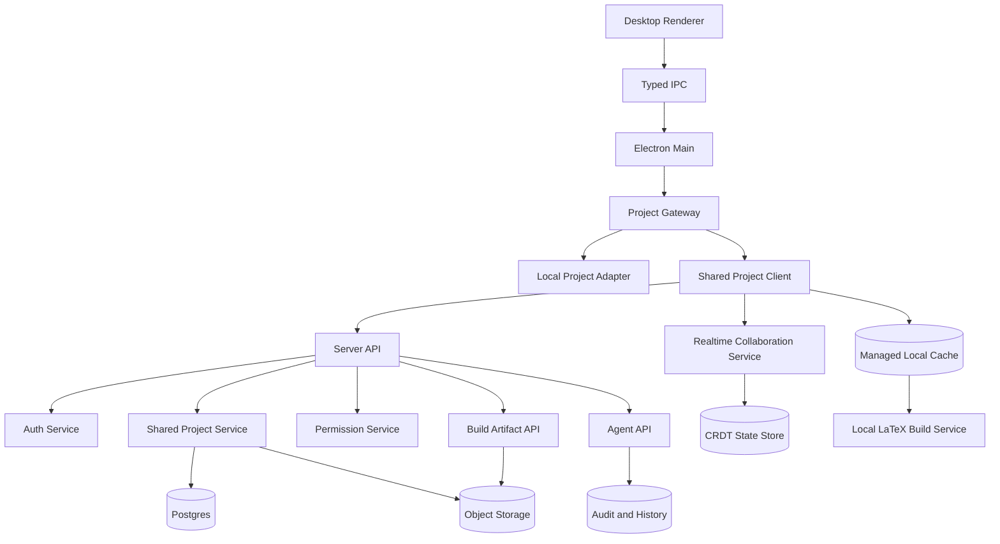

# Shared Project Collaboration Design

Date: 2026-06-15

## Purpose

Add Overleaf-style project sharing to ZeroLeaf while preserving ZeroLeaf as a desktop app that uses the user's computer for editing, agent tooling, LaTeX compilation, SyncTeX, and PDF preview. The server is the collaboration and project-state authority: it stores an updated copy of shared projects, manages identity and permissions, coordinates realtime edits, and records activity. It is not the default compile engine.

## Product Goals

- Users can create server-backed shared LaTeX projects from the desktop app.
- Project owners can invite other users by email and assign access roles.
- Collaborators can open the same project from their own local desktop app.
- Multiple users can edit project files concurrently with low-latency updates.
- Shared projects compile on each collaborator's local computer by default.
- Local compile outputs can be attached to the server revision they were built from.
- Agent actions remain scoped, attributable, reviewable, and reversible in shared projects.
- Local projects continue to work without an account, network connection, or server dependency.

## Non-Goals

- Do not convert all local projects into shared projects automatically.
- Do not sync arbitrary user folders.
- Do not allow the agent to write directly to a shared local filesystem folder as the sharing mechanism.
- Do not make server-side compilation the default shared-project path.
- Do not require a browser or hosted IDE surface for shared projects.
- Do not support anonymous public editing in the first version.

## Project Types

ZeroLeaf should support two first-class project types:

| Type           | Source of truth                        | Collaboration                  | Compile path                           | Offline behavior                                       |
| -------------- | -------------------------------------- | ------------------------------ | -------------------------------------- | ------------------------------------------------------ |
| Local Project  | User-selected folder on disk           | None, except manual export/Git | Local `latexmk`                        | Fully usable                                           |
| Shared Project | Server copy plus managed desktop cache | Invite-based realtime sharing  | Local `latexmk` from the desktop cache | Explicit offline cache with reconciliation rules later |

This separation keeps the existing local security model intact. Shared projects should not be represented internally as arbitrary writable folders that happen to sync in the background. They need an explicit shared project adapter behind the same renderer-facing project UI, backed by a managed local cache.

## User Experience

### Create Shared Project

1. User signs in.
2. User selects `New Shared Project`.
3. User chooses a template or imports a source zip.
4. App creates the project in the server project service.
5. The desktop app materializes a managed local cache.
6. The project opens in the normal editor shell with a shared-project sync indicator.

### Share Project

1. Owner opens project sharing settings.
2. Owner enters collaborator email addresses.
3. Owner selects role: Owner, Editor, Viewer.
4. Service sends invitations.
5. Collaborators accept and the project appears in their shared project list.

### Collaborative Editing

1. User opens a shared project.
2. App connects to the realtime collaboration service.
3. File tree, active document state, and user presence load.
4. Text edits are sent as collaboration operations.
5. Remote edits appear in the editor without manual refresh.
6. Save status reflects server acknowledgement rather than local disk writes.

### Compile

1. User clicks `Compile`.
2. App ensures the managed local cache is at a known project revision.
3. The existing local LaTeX build service runs `latexmk` from the cache.
4. App shows local build status, logs, diagnostics, SyncTeX, and final PDF.
5. App may upload the PDF, raw log, diagnostics, compiler, and TeX toolchain metadata as an artifact attached to the source revision.

### Agent Use

1. User asks the agent to inspect or edit a shared project.
2. Agent tools operate through the project gateway, not arbitrary local filesystem paths.
3. Proposed edits are represented as changesets.
4. Edits are attributed to the requesting user and agent provider.
5. Accepted edits update the local cache and are uploaded as server revisions or enter the realtime document stream.
6. Agent-triggered compiles run through the local build service by default, with optional artifact upload.

## Roles and Permissions

| Role   | Capabilities                                                                                                                                |
| ------ | ------------------------------------------------------------------------------------------------------------------------------------------- |
| Owner  | Manage project, billing/workspace membership later, collaborators, roles, deletion, transfer ownership, edit, compile, run agent if enabled |
| Editor | Edit files, upload assets, compile, comment later, run permitted agent actions                                                              |
| Viewer | Read source, view PDF, download allowed artifacts, no edits                                                                                 |

Future roles can include Commenter and Reviewer, but the first implementation should keep permissions small and enforceable.

Permission checks must happen server-side for every project operation. Renderer-side permission gating is only a usability layer.

## High-Level Architecture



## Desktop App Changes

### Project Gateway

Introduce a project gateway abstraction used by the main process and agent tool broker:

- `LocalProjectAdapter`: wraps existing filesystem-backed project service.
- `SharedProjectGatewayAdapter`: wraps authenticated server APIs, realtime sessions, and the managed local cache from `packages/shared-project-client`.

The renderer should keep using typed IPC contracts. It should not receive cloud tokens beyond short-lived session state needed for the preload-safe bridge, and it should never call arbitrary cloud endpoints directly.

Suggested interface shape:

```ts
type ProjectBackendKind = "local" | "shared";

type ProjectHandle = {
  readonly id: string;
  readonly backend: ProjectBackendKind;
  readonly displayName: string;
  readonly rootPath?: string;
  readonly localCachePath?: string;
  readonly sharedProjectId?: string;
  readonly syncState?: "synced" | "syncing" | "offline" | "conflict" | "read-only";
};

type ProjectGateway = {
  listRecentProjects(): Promise<readonly ProjectHandle[]>;
  openProject(handle: ProjectHandle): Promise<ProjectSession>;
  readFile(sessionId: string, path: string): Promise<ProjectFileSnapshot>;
  writeFile(
    sessionId: string,
    path: string,
    contents: string
  ): Promise<ProjectWriteResult>;
  listFiles(sessionId: string): Promise<ProjectTree>;
  createEntry(sessionId: string, request: CreateEntryRequest): Promise<ProjectTree>;
  deleteEntry(sessionId: string, request: DeleteEntryRequest): Promise<ProjectTree>;
  runBuild(sessionId: string, request: BuildRequest): Promise<BuildResult>;
};
```

For shared projects, `writeFile` should initially upload a whole-file revision after updating the managed local cache. Later, for realtime-supported text files, it becomes a compatibility wrapper over collaboration operations or server-side patches. Direct whole-file writes are acceptable for an early non-realtime milestone but should not be the final collaboration mechanism.

### Editor State

Shared text editing should use a document collaboration provider. Monaco can be bound to Yjs with `y-monaco` or a local adapter around Y.Text. The app should keep editor features independent from the transport:

- local projects use ordinary text models and explicit saves;
- shared projects use collaborative text models and server acknowledgement;
- both paths expose the same diagnostics, outline, references, and agent UI where practical.

### UI Additions

- Account sign-in state in the title bar or project dashboard.
- Shared project list on dashboard.
- `New Shared Project` action.
- `Share` button in project toolbar.
- Collaborator avatars or initials near the editor toolbar.
- Sync status: Connected, Syncing, Reconnecting, Offline, Conflict, Read-only.
- Project type badge: Local or Shared.
- Role-aware disabled states with clear messages.

## Cloud Backend Components

### Auth Service

Responsibilities:

- user registration and sign-in;
- email verification;
- password reset and OAuth later;
- session refresh tokens;
- device/session management.

The desktop app should store refresh credentials in the OS keychain through the main process. Access tokens should be short-lived.

### Shared Project Service

Responsibilities:

- project metadata;
- file tree metadata;
- file content snapshots;
- binary asset upload/download;
- project settings including main file and compiler;
- collaborator invitations and membership;
- version history anchors.

Postgres should store metadata, permissions, revisions, and audit records. Object storage should store binary assets, build artifacts, source archives, and larger snapshots.

### Realtime Collaboration Service

Use CRDT-based collaboration for text files. Yjs is the recommended first choice because it has mature bindings for web editors and works well with WebSocket providers.

Responsibilities:

- WebSocket session management;
- authorization per project and file;
- CRDT update broadcast;
- persistence of document updates;
- presence and cursor metadata;
- reconnect and catch-up logic.

The first realtime scope should be `.tex`, `.bib`, `.cls`, `.sty`, and plain text files. Binary assets should use upload/replace semantics rather than realtime editing.

### Local Build Artifact Service

Responsibilities:

- accept uploaded build artifacts from authenticated desktop apps;
- require artifacts to reference an immutable source revision;
- store PDF, raw log, diagnostics, compiler, engine version, platform, and build timestamp;
- mark artifacts as local-machine outputs rather than canonical server compiles;
- allow collaborators to view or download recent artifacts when permitted.

A future server compile service can be added later as an optional fallback for collaborators without a local TeX toolchain. It is not part of the default shared-project model.

### Agent API

Shared-project agent support should reuse the provider-neutral agent model but change the tool backend:

- local project tools call local services;
- shared project tools call the project gateway, update the managed local cache, and publish accepted revisions to the server;
- all shared agent actions require user identity, project role, and audit logging;
- destructive actions require explicit approval;
- edit proposals are changesets with per-file diffs.

Agent runs should be visible to collaborators as project activity. Later, owners can configure whether Editors may run agents and whether autonomous local mode is allowed for shared projects.

## Data Model Sketch

Core tables:

- `users`
- `sessions`
- `projects`
- `project_members`
- `project_invitations`
- `project_files`
- `file_revisions`
- `document_crdt_updates`
- `build_artifacts`
- `changesets`
- `agent_runs`
- `audit_events`

Important fields:

- every mutable project operation includes `actor_user_id`;
- every file revision belongs to a `project_id`;
- build artifacts reference an immutable project revision id and a local desktop client id;
- shared agent runs reference project id, actor user id, provider id, mode, requested prompt hash, changeset ids, and build artifact ids.

## Sync and Conflict Model

Realtime text files should avoid manual conflict resolution by using CRDT operations. Non-realtime operations still need clear rules:

- file rename/delete conflicts are serialized through the project service;
- binary asset replacement uses last-writer-wins with revision history;
- permission changes take effect immediately and can close active realtime sessions;
- offline edits are not in scope for the first shared-project release beyond read-only cache access.

Offline support can be added later with explicit local caches and reconciliation rules. It should not be implied by the first shared-project implementation.

## Security Requirements

- All cloud API calls require authenticated user identity.
- Every project operation is authorized server-side.
- Access tokens are short-lived; refresh tokens live in OS keychain storage.
- Realtime WebSocket sessions authenticate at connect and revalidate project membership.
- Local builds keep the existing desktop build security policy.
- Shell escape remains disabled by default and controlled by explicit user approval.
- Agent tools are scoped to the active shared project.
- Agent edits are audit-logged and reversible.
- Secrets and provider credentials are not exposed to the renderer.
- Public sharing links are not part of the initial implementation.

## Privacy Requirements

- Users must understand whether a project is local or shared/server-backed.
- Shared projects upload source files and assets to ZeroLeaf servers.
- Local compile uses the user's TeX toolchain and compute.
- Uploaded build artifacts may reveal local compiler versions, logs, and output PDFs.
- Agent usage may send scoped project context to the selected AI provider, subject to provider settings.
- Project owners should be able to export and delete shared project data.

## API Surface Sketch

Initial REST or RPC endpoints:

- `POST /auth/sign-in`
- `POST /auth/refresh`
- `POST /auth/sign-out`
- `GET /projects`
- `POST /projects`
- `GET /projects/:projectId`
- `PATCH /projects/:projectId/settings`
- `POST /projects/:projectId/invitations`
- `PATCH /projects/:projectId/members/:userId`
- `DELETE /projects/:projectId/members/:userId`
- `GET /projects/:projectId/tree`
- `GET /projects/:projectId/files/:path`
- `PUT /projects/:projectId/files/:path`
- `POST /projects/:projectId/files`
- `PATCH /projects/:projectId/files/:path`
- `DELETE /projects/:projectId/files/:path`
- `POST /projects/:projectId/build-artifacts`
- `GET /projects/:projectId/build-artifacts/:artifactId`
- `GET /projects/:projectId/artifacts/:artifactId`
- `POST /projects/:projectId/agent-runs`
- `GET /projects/:projectId/activity`

Realtime endpoints:

- `wss /projects/:projectId/realtime`
- document channel keyed by normalized file path;
- presence channel keyed by project id;
- artifact notification stream keyed by project id.

## Phased Implementation

### Phase C0: Architecture Preparation

- Add `ProjectBackendKind` and project gateway concepts.
- Keep local projects on the existing local adapter.
- Make renderer UI display project type.
- Ensure agent tool broker can route by project backend.

Exit criteria:

- No behavior change for local projects.
- Type-level distinction exists between local and future shared project sessions.

### Phase C1: Accounts and Shared Project Storage

- Add sign-in and session storage.
- Add shared project list.
- Create/open shared projects.
- Implement file tree and whole-file read/write through server APIs.
- Add import zip to shared project.

Exit criteria:

- One user can create a shared project, edit files, close app, reopen project from another computer, and see the latest source.

### Phase C2: Invite-Based Sharing

- Add invitations and project membership.
- Add Owner, Editor, Viewer roles.
- Add share dialog.
- Enforce permissions server-side.

Exit criteria:

- Owner can invite another account.
- Editor can edit and compile.
- Viewer can open and view but cannot edit.

### Phase C3: Desktop Cache and Local Compile Artifacts

- Materialize shared projects into managed desktop caches.
- Run the existing local build service against the cache.
- Upload optional PDF/log/diagnostic artifacts tied to the source revision.

Exit criteria:

- A collaborator can compile a shared project locally from the managed cache.
- Other collaborators can see which source revision was compiled and inspect uploaded artifacts.

### Phase C4: Realtime Editing

- Add Yjs-backed collaboration for text files.
- Add presence and remote cursor display.
- Replace whole-file save for text documents with collaborative update persistence.

Exit criteria:

- Two users can edit the same `.tex` file at the same time and both see changes without refresh.

### Phase C5: Shared Agent Support

- Route agent tools through the project gateway for shared projects.
- Store shared-project agent audit events.
- Apply agent changes as changesets or collaborative patches.
- Support agent-triggered local compile verification and optional artifact upload.

Exit criteria:

- An Editor can ask the agent to fix a compile error in a shared project.
- Collaborators can see the resulting changeset, audit event, and compile result.

## Testing Strategy

- Unit tests for permission checks and project gateway routing.
- Integration tests for cloud file CRUD, invitations, and role enforcement.
- Realtime tests with two clients editing the same document.
- Local cache compile tests using representative LaTeX projects and failure cases.
- Agent tests using real shared project APIs, local build execution, and the connected provider path.
- End-to-end desktop tests for create, invite, edit, compile, and agent-fix workflows.

Acceptance evidence for cloud sharing must not rely only on mocked providers or smoke tests. It needs multi-user project state, real file changes, and real compile outputs.

## Open Decisions

- Backend deployment target: self-hosted first, managed cloud first, or both.
- Auth provider: custom auth, Clerk/Auth0/Supabase Auth, or organization SSO later.
- Collaboration persistence model: raw Yjs updates, periodic snapshots, or both.
- Billing/workspace model: personal projects only first or teams/workspaces from the start.
- Local cache policy for shared projects.
- Whether optional server-side compile is ever needed, and how to mark it separately from local outputs.

## Risks

- Realtime collaboration materially increases product and operational complexity.
- Optional future server compile would introduce security exposure from untrusted LaTeX projects.
- Mixing local and shared project semantics can create data-loss bugs if project backend boundaries are weak.
- Agent changes in shared projects need stronger audit and permission handling than local projects.
- Offline editing can create hard reconciliation problems and should be deferred until the cloud baseline is reliable.

## Recommended First Milestone

Start with C0 and C1 only: authenticated shared projects with whole-file save and reopen across devices. This gives users a real server-backed project source of truth before adding realtime editing. Once storage, identity, permissions, and project gateway boundaries are stable, add invite sharing, managed desktop cache plus local compile artifacts, realtime editing, and agent support in that order.
