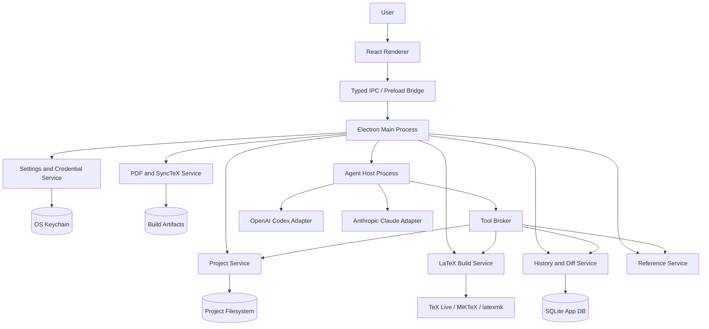

# ZeroLeaf System Architecture

Date: 2026-06-07

## Product Goal

Build a desktop LaTeX writing environment with Overleaf-class project editing, compilation, PDF preview, citations, review/history, and an integrated AI agent that can safely read, edit, compile, and verify project files.

The key difference from Overleaf is that the agent is not a side assistant. It is a project operator: it can inspect the file tree, apply patches, fix LaTeX errors, update references, generate tables/equations, reorganize chapters, run compiles, and report verified results.

## Architecture Principles

- Local-first: source files live on the user's machine and remain usable outside the app.
- Provider-neutral agents: Codex and Claude are adapters behind one internal agent contract.
- Least privilege: the UI never receives provider secrets, and the agent never gets unrestricted filesystem or shell access by default.
- Patch-first editing: agent edits are represented as reviewable changesets before or during application.
- Compile-verification loop: meaningful agent edits should end with a LaTeX compile or a clear reason why verification could not run.
- Extensible collaboration: single-user desktop workflows come first, but editor state should not block a future CRDT-based collaboration layer.

## Recommended Stack

Use Electron + React + TypeScript for the first product version.

Reasons:

- The app needs a high-quality web-style editor surface: Monaco, PDF.js, resizable panes, command palette, search, and rich UI are mature in the web stack.
- Both Codex and Claude have strong programmatic Node/TypeScript paths. OpenAI documents a Codex TypeScript SDK for integrating Codex into applications, and Anthropic documents a Claude Agent SDK with TypeScript/Python support.
- Electron gives straightforward access to local processes for LaTeX compilers, Git, file watching, and agent subprocesses.
- The security model remains acceptable if Node is disabled in the renderer, IPC is typed and narrow, and agent execution is isolated outside the renderer and main window process.

Do not embed agent execution directly in the renderer. The renderer is UI only.

Alternative considered: Tauri + React + Rust core. This is attractive for memory footprint and native security, but it adds complexity because the agent SDK/runtime layer still needs Node or Python sidecars. Keep the service boundaries clean enough that a Tauri shell could replace Electron later.

## High-Level System



## Process Boundaries

### Renderer

Responsibilities:

- Project tree
- Monaco editor
- Visual/rich editing surface later
- PDF.js viewer
- Diagnostics panel
- Agent chat/activity panel
- Diff/review UI
- Comments/review UI
- Settings screens

Constraints:

- `nodeIntegration: false`
- `contextIsolation: true`
- No direct filesystem, shell, or credential access
- All actions through typed IPC

### Main Process

Responsibilities:

- Window lifecycle
- Native dialogs and menus
- IPC routing
- Service lifecycle
- Agent Host process supervision
- App updates and crash reporting, if added

The main process should not contain business-heavy agent logic. It routes commands to services.

### Agent Host Process

Separate local Node process. It owns provider SDKs, streaming agent events, and provider-specific session state.

Responsibilities:

- Normalize Codex/Claude events into app events
- Expose one internal `AgentProvider` interface
- Hold agent session state
- Call only approved tools through the Tool Broker
- Stream reasoning/activity/tool calls to the UI
- Persist session metadata through the main process

The Agent Host should be restartable without corrupting project files. On crash, active changesets remain recoverable from the History/Diff service.

## Core Services

### Project Service

Owns project roots and file operations.

Features:

- Open folder/project
- Create project from template
- Import zip
- Add/rename/delete/move files
- Detect main `.tex` file
- Watch file changes
- Maintain project metadata
- Prevent path traversal outside the project root

Project files remain normal files on disk. App metadata lives outside source files unless explicitly project-scoped.

Recommended project metadata:

```text
<project>/
  main.tex
  sections/
  figures/
  refs.bib
  .latex-agent/
    project.json
    build/
    cache/
    history/
```

If the project is already a Git repository, do not write history into `.git` unless the user opts in.

### Editor Service

Owns editor document state and synchronization with files.

Features:

- Open buffers
- Dirty tracking
- Autosave policy
- Search and replace
- Symbol/outline extraction
- LaTeX-aware autocomplete hooks
- Optional future CRDT document model

Use Monaco for the code editor. The visual editor can come later and should initially operate as a structured layer over LaTeX blocks, not as a lossy Markdown conversion.

### LaTeX Build Service

Owns compilation and diagnostics.

Primary build path:

- `latexmk` as the default orchestrator
- Support `pdflatex`, `xelatex`, `lualatex`
- Support BibTeX, Biber, MakeIndex through `latexmk`
- Generate SyncTeX
- Build in `.latex-agent/build/<profile>/`

Fallback/simple path:

- Optional Tectonic mode for lightweight projects
- It should not replace `latexmk` as the compatibility default

Security defaults:

- Disable `-shell-escape`
- Use process timeouts
- Limit output size
- Kill process trees on cancellation
- Prompt before network package fetches or external scripts

Outputs:

- PDF artifact path
- Raw log
- Parsed diagnostics
- Build duration
- Engine/version info
- SyncTeX file path

### PDF and SyncTeX Service

Responsibilities:

- Serve built PDF pages to the renderer
- Source-to-PDF jump
- PDF-to-source jump
- Page thumbnails
- Search inside PDF
- Detect stale preview state

Renderer uses PDF.js. SyncTeX lookup should be done by a local service/CLI wrapper so the renderer does not invoke native binaries.

### Reference Service

Responsibilities:

- Parse `.bib` files
- Citation key autocomplete
- Detect missing/unused references
- Insert citation commands
- Optional external integrations: Zotero, Mendeley, DOI lookup

Start local-only with `.bib` parsing. External reference manager sync should be an integration module, not core editor logic.

### History and Diff Service

Responsibilities:

- File snapshots before agent edits
- Agent changesets
- Human-readable diffs
- Restore file/project versions
- Label versions
- Track accepted/rejected agent edits

Recommended implementation:

- Store metadata in SQLite
- Store file snapshots or patch blobs under `.latex-agent/history/`
- If the project is a Git repo, offer Git-backed history integration but do not require it

Every agent write should create a changeset:

```ts
type ChangeSet = {
  id: string;
  projectId: string;
  agentSessionId?: string;
  baseSnapshotId: string;
  summary: string;
  patch: string;
  status: "proposed" | "applied" | "reverted" | "failed";
  createdAt: string;
};
```

## Agent Architecture

### Provider Interface

All providers implement one interface:

```ts
interface AgentProvider {
  id: "openai-codex" | "anthropic-claude";
  checkAuth(): Promise<AuthStatus>;
  startSession(input: StartAgentSession): Promise<AgentSessionHandle>;
  sendMessage(sessionId: string, message: string): AsyncIterable<AgentEvent>;
  cancel(sessionId: string): Promise<void>;
}
```

### OpenAI Codex Adapter

Primary path:

- Use `@openai/codex-sdk` in the Agent Host.
- Start/resume Codex threads per project/task.
- Use sandbox modes per task: read-only for analysis, workspace-write for approved edits.

Fallback path:

- Use `codex exec --json` for one-shot tasks where SDK integration is not available.

Auth model:

- Support ChatGPT sign-in where Codex supports subscription access.
- Support API key auth for usage-based access.
- Store credentials in the OS credential store where possible.
- Never expose OpenAI credentials to the renderer.

### Anthropic Claude Adapter

Primary path:

- Use `@anthropic-ai/claude-agent-sdk` in the Agent Host.
- Stream SDK messages into the common `AgentEvent` format.
- Configure allowed tools narrowly.

Fallback path:

- Use `claude -p --output-format stream-json` for one-shot tasks.

Auth model:

- Use Anthropic API key auth by default.
- Treat direct claude.ai subscription/rate-limit use in a third-party app as approval-dependent. Anthropic's Agent SDK docs state third-party products should use API-key methods unless previously approved.

### Tool Broker

The agent does not get raw filesystem and shell access from the app.

Instead it receives app-native tools:

- `list_project_files`
- `read_project_file`
- `search_project`
- `propose_patch`
- `apply_patch`
- `run_latex_build`
- `read_build_log`
- `get_diagnostics`
- `render_pdf_page`
- `synctex_forward`
- `synctex_reverse`
- `parse_bib`
- `insert_citation`
- `ask_user_approval`

Tool risk levels:

| Level     | Examples                                                  | Approval                       |
| --------- | --------------------------------------------------------- | ------------------------------ |
| Read      | list/read/search files, read diagnostics                  | No prompt                      |
| Build     | run LaTeX compile with safe flags                         | User-configurable              |
| Write     | apply patch, create/rename/delete project files           | Prompt or agent mode dependent |
| External  | network, package install, git push, shell escape          | Always prompt                  |
| Dangerous | outside-root writes, credential access, destructive shell | Block by default               |

### Agent Modes

Recommended modes:

- Read-only: explain, summarize, inspect errors.
- Suggest: produce patch but do not apply.
- Apply with review: apply patch after user approval.
- Autonomous local loop: allowed to edit project files and compile until success, bounded by max turns/time and no external actions.

Default should be Suggest or Apply with review, not full autonomous editing.

## Main Workflows

### Edit and Compile

1. User opens project.
2. Project Service detects files and main document.
3. User edits in Monaco.
4. Editor Service saves buffer.
5. Build Service runs `latexmk`.
6. Diagnostics are parsed and displayed.
7. PDF Service refreshes preview.
8. SyncTeX maps source and PDF positions.

### Agent Fixes Compile Errors

1. User clicks "Fix errors" or asks the agent.
2. Agent Host starts a provider session in project context.
3. Build Service runs compile if diagnostics are stale.
4. Agent receives project summary, relevant files, diagnostics, and tool contract.
5. Agent proposes or applies a patch through Tool Broker.
6. History Service snapshots changed files.
7. Build Service recompiles.
8. Agent iterates within limits.
9. UI shows final status, diff, diagnostics, and PDF result.

### Agent Rewrites a Section

1. User selects text or a file/section.
2. Agent receives bounded context.
3. Agent returns a patch.
4. User reviews diff inline.
5. Apply creates a changeset and updates editor buffer.
6. Optional compile verifies no LaTeX breakage.

### Citation Insertion

1. User asks for a citation or types `\cite{`.
2. Reference Service searches local `.bib`.
3. Agent may inspect surrounding text and suggest keys.
4. Insert operation is a normal editor edit.
5. Compile validates bibliography.

## Data Model

Store app metadata in SQLite.

```ts
type Project = {
  id: string;
  rootPath: string;
  displayName: string;
  mainFilePath?: string;
  compiler: "pdflatex" | "xelatex" | "lualatex";
  bibliographyTool?: "bibtex" | "biber";
  createdAt: string;
  updatedAt: string;
};

type BuildJob = {
  id: string;
  projectId: string;
  status: "queued" | "running" | "succeeded" | "failed" | "cancelled";
  command: string[];
  startedAt: string;
  finishedAt?: string;
  pdfPath?: string;
  logPath?: string;
};

type Diagnostic = {
  id: string;
  buildJobId: string;
  filePath?: string;
  line?: number;
  column?: number;
  severity: "error" | "warning" | "info";
  message: string;
  rawExcerpt?: string;
};

type AgentSession = {
  id: string;
  projectId: string;
  provider: "openai-codex" | "anthropic-claude";
  providerThreadId?: string;
  mode: "read-only" | "suggest" | "apply-with-review" | "autonomous-local";
  status: "running" | "waiting-for-approval" | "completed" | "failed" | "cancelled";
  createdAt: string;
  updatedAt: string;
};
```

## IPC Contract

Use one typed IPC layer shared by renderer and main process.

Example namespaces:

- `project.open`
- `project.create`
- `project.listRecent`
- `file.read`
- `file.write`
- `file.applyPatch`
- `editor.resolveOutline`
- `build.run`
- `build.cancel`
- `build.getDiagnostics`
- `pdf.openArtifact`
- `pdf.forwardSearch`
- `pdf.reverseSearch`
- `agent.start`
- `agent.sendMessage`
- `agent.cancel`
- `agent.approveToolCall`
- `history.listChangesets`
- `history.restore`
- `settings.get`
- `settings.set`
- `credentials.connectProvider`
- `credentials.disconnectProvider`

IPC payloads should be schema-validated with Zod or equivalent. Renderer-originated paths must be resolved and checked against the project root by the main process.

## Repository Layout

Recommended monorepo layout:

```text
apps/
  desktop/
    src/
      main/
      preload/
      renderer/
packages/
  core-domain/
  ipc-contracts/
  project-service/
  latex-service/
  pdf-service/
  reference-service/
  history-service/
  agent-host/
  provider-openai-codex/
  provider-anthropic-claude/
  security/
  ui/
docs/
  architecture/
  product/
```

Keep provider adapters outside core domain code. The rest of the app should not know provider-specific SDK event shapes.

## Security Model

### Filesystem

- All file tools are project-root scoped.
- Path traversal is blocked after canonical path resolution.
- Writes outside the project root require explicit user approval and should be disabled for MVP.
- Agent edits are transactional: snapshot, patch, apply, verify, rollback if needed.

### Commands

- The app should not expose a generic unrestricted shell tool in MVP.
- LaTeX builds run through Build Service only.
- Shell escape is disabled by default.
- Commands have timeouts, output caps, and cancellation.
- External network/package operations require explicit approval.

### Credentials

- Store provider credentials in OS keychain/credential manager.
- Never persist secrets in project files.
- Never send credentials to the renderer.
- Never include secrets in agent prompts or logs.

### Prompt Injection

- Treat project files, PDFs, bibliography entries, web pages, and build logs as untrusted content.
- The system/tool policy lives outside the project and is not editable by the agent.
- Tools return data as data, not instructions.
- Network tools are disabled by default.

## Collaboration Path

Do not build real-time multiplayer editing in the MVP unless it is the explicit first market requirement.

For future collaboration:

- Introduce Yjs documents per file.
- Use awareness/presence for cursors.
- Store comments and suggestions as structured annotations.
- Sync through a cloud relay or self-hosted workspace server.
- Keep LaTeX compilation local initially, then add optional remote build workers.

This architecture keeps collaboration possible because editor state, file persistence, and history are already separated.

## MVP Build Order

1. Desktop shell, project open/create, file tree, Monaco editor.
2. Save/load/autosave, project metadata, recent projects.
3. LaTeX build service with `latexmk`, diagnostics, PDF.js preview.
4. SyncTeX source/PDF navigation.
5. History snapshots and diff viewer.
6. Agent Host with a mock provider and app-native tools.
7. Codex adapter.
8. Claude adapter.
9. Agent "fix compile errors" loop with compile verification.
10. Reference manager and citation autocomplete.
11. Templates/import/export.

## Key Risks

- Provider auth assumptions: OpenAI supports Codex ChatGPT sign-in and API-key paths, but API-key usage follows Platform billing. Anthropic's public Agent SDK guidance currently directs third-party products to API-key auth unless approved for claude.ai login/rate-limit use.
- LaTeX compatibility: full TeX Live/MiKTeX behavior is hard to bundle. Prefer system TeX detection first, with guided setup.
- Security: LaTeX can run external commands if shell escape is enabled. Keep it off by default.
- Agent trust: never make raw shell/full filesystem access the default path.
- Scope creep: real-time collaboration and visual editing are both large systems. Ship code editor + compile + agent loop first.

## Source References

- OpenAI Codex SDK: https://developers.openai.com/codex/sdk.md
- OpenAI Codex authentication: https://developers.openai.com/codex/auth.md
- Anthropic Claude Agent SDK overview: https://code.claude.com/docs/en/agent-sdk/overview
- Anthropic Claude Code CLI reference: https://code.claude.com/docs/en/cli-usage
- Anthropic Claude Code security: https://code.claude.com/docs/en/security
- Overleaf feature overview: https://www.overleaf.com/about/features-overview
- Overleaf compile behavior: https://www.overleaf.com/learn/how-to/How_does_Overleaf_compile_my_project%3F
